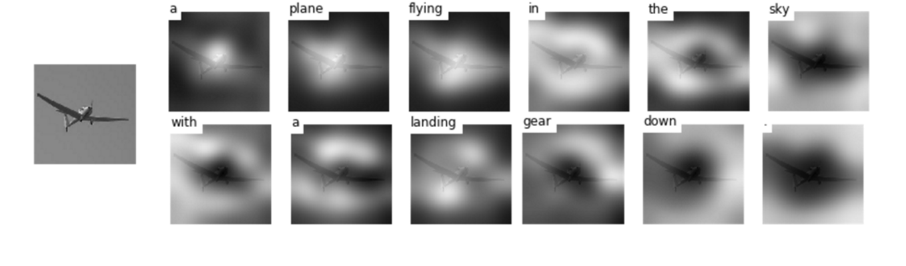
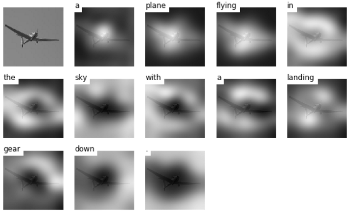
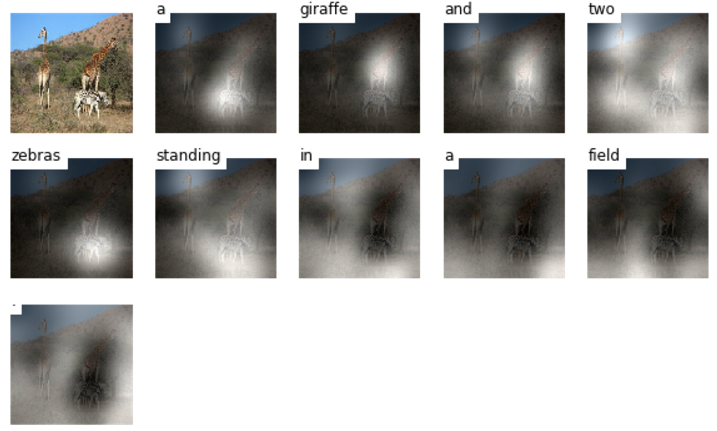
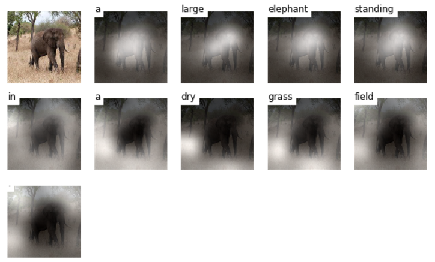
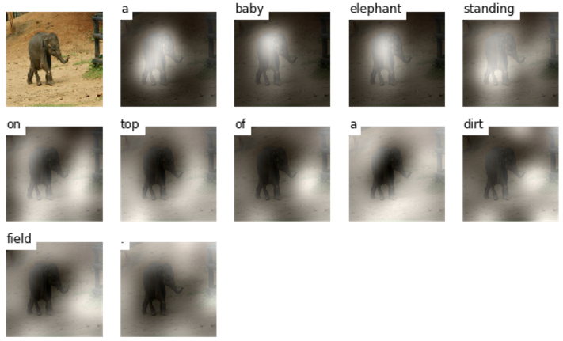
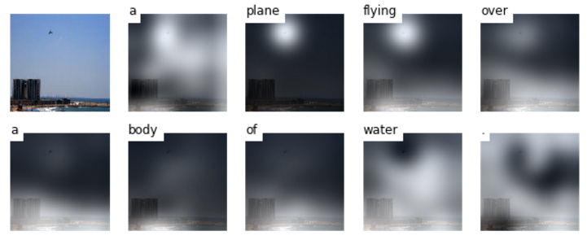
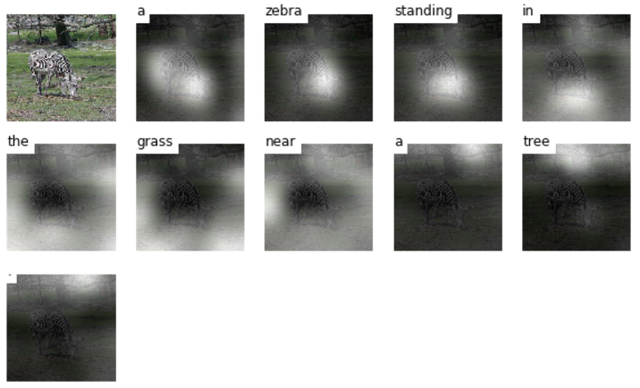

# Show, Attend and Tell
本仓库包含原论文、自己对论文的中文翻译、基于Tensorflow框架的模型实现(参考开源的基础上做了一些修改) 

**我对原论文的详细解析：[http://yikunhaocong.com/2018/01/20/Visual-Attention/](http://yikunhaocong.com/2018/01/20/Visual-Attention/)** 

**本仓库模型算法实现细节将在不久后更新**

TensorFlow implementation of [Show, Attend and Tell: Neural Image Caption Generation with Visual Attention](http://arxiv.org/abs/1502.03044)

<br/>



<br/>


## 引用

原作者 theano 代码: https://github.com/kelvinxu/arctic-captions 

Tensorflow实现: 
https://github.com/yunjey/show-attend-and-tell

<br/>


## 运行方法

### 所需配置

在同一目录下安装 [pycocoevalcap](https://github.com/tylin/coco-caption.git) 

```bash
$ git clone https://github.com/yunjey/show-attend-and-tell-tensorflow.git
$ git clone https://github.com/tylin/coco-caption.git
```

该代码基于Python2.7，需要安装[TensorFlow](https://www.tensorflow.org/versions/r0.11/get_started/os_setup.html#anaconda-installation). 此外，还需要安装一些库来处理数据集[MSCOCO data set](http://mscoco.org/home/). 可以使用./download.sh脚本来下载<i>MSCOCO image dataset</i> 和[VGGNet19 model](http://www.vlfeat.org/matconvnet/pretrained/). 

可能需要比较长的时间来下载数据，运行脚本后图像数据将会保存在 `image/`目录，<i>VGGNet19 model</i>将会保存在`data/`目录。

```bash
$ cd show-attend-and-tell-tensorflow
$ pip install -r requirements.txt
$ chmod +x ./download.sh
$ ./download.sh
```


为了使图像能够输入到<i>VGGNet</i>网络中，需要先把  <i>MSCOCO image dataset</i>数据集中的图像转换为224*224格式

运行下面的命令会格式化图像并保存至`image/train2014_resized/` 和`image/val2014_resized/`目录中

```bash
$ python resize.py
```

在开始训练模型前，需要先预处理<i>MSCOCO caption dataset</i>数据集(也就是原论文所说的把标题描述数量统一化)，运行下面的命令生成标题描述数据集和对应的图片特征向量

```bash
$ python prepro.py
```
<br>

### 模型训练 

运行下面指令，开始训练图片描述生成模型 

```bash
$ python train.py
```
<br>

### (可选) Tensorboard 可视化

提供了一个可视化实时运行情况的tensorboard
打开命令行，运行下面的指令并打开浏览器`http://localhost:6005/`窗口


```bash
$ tensorboard --logdir='./log' --port=6005 
```
<br>

### 模型评估

如果想生成描述并可视化聚焦的权重和评估模型，请使用`evaluate_model.ipynb`

<br/>

## 模型结果
 
<br/>

#### Training data

##### (1) Generated caption: A plane flying in the sky with a landing gear down.


##### (2) Generated caption: A giraffe and two zebra standing in the field.


#### Validation data

##### (1) Generated caption: A large elephant standing in a dry grass field.


##### (2) Generated caption: A baby elephant standing on top of a dirt field.


#### Test data

##### (1) Generated caption: A plane flying over a body of water.


##### (2) Generated caption: A zebra standing in the grass near a tree.


